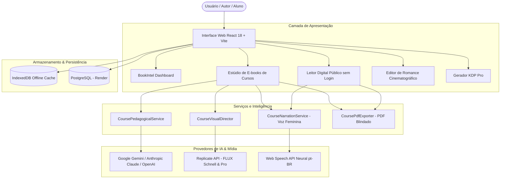
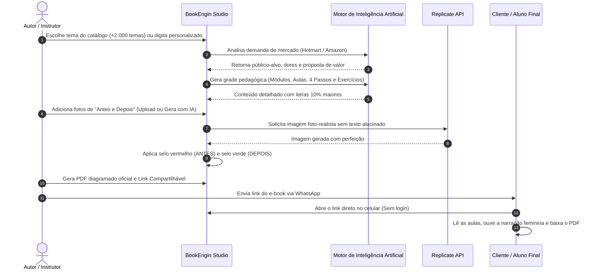

# 📚 BookEngin • Plataforma Editorial com IA & Estúdio de E-books de Cursos

> **A plataforma definitiva para pesquisa de mercado, escrita com inteligência artificial, geração de ilustrações realistas, narração por voz e publicação digital profissional.**

[](https://book-intel-kdp.onrender.com/)
[](https://react.dev/)
[](https://vitejs.dev/)
[](https://replicate.com/)
[](https://vitest.dev/)

---

## 🌟 Visão Geral do Produto

O **BookEngin** é uma solução completa de engenharia editorial que transforma ideias brutas e demandas reais de mercado em **e-books didáticos de alto padrão, romances cinematográficos ilustrados e livros prontos para o Amazon KDP**.

A plataforma opera simultaneamente como:
1. **SaaS Web Completo:** com autenticação segura, persistência em PostgreSQL, cache local IndexedDB (offline-first) e dashboard financeiro.
2. **Estúdio de Cursos Profissionais:** criador de apostilas e e-books didáticos ilustrados passo a passo, com áudio de voz feminina e link de leitura para clientes.
3. **Estúdio de Romance Cinematográfico:** motor de narrativa fotográfica 35mm com roteiro visual e consistência de personagens.
4. **Extensão Chromium (Manifest V3):** inteligência de mercado integrada às 22 lojas globais da Amazon com estimativa de BSR, vendas e royalties.

---

## 🚀 Principais Módulos & Recursos

### 1. 🎓 Estúdio de E-books de Cursos Profissionais (Novo)
O módulo mais avançado para criadores de conteúdo, instrutores e infoprodutores que desejam lançar materiais didáticos impecáveis.

* **Catálogo de +2.000 Temas Profissionais:** Navegue por 24 nichos técnicos (Beleza & Estética, Culinária & Confeitaria, Marcenaria, Marketing, Saúde, Programação, etc.) com níveis iniciante a avançado.
* **Pesquisa de Mercado Hotmart & Amazon:** Validação automática da demanda do público, público-alvo, dores reais e análise de concorrentes de mercado.
* **Engenharia Pedagógica Inteligente:** Estruturação automática em módulos didáticos, aulas sequenciais, introdução densa, explicações aprofundadas e 4 passos operacionais por aula.
* **Tipografia Otimizada (+10% Maior):** Fontes 10% maiores (11pt no corpo) com entrelinhamento generoso para máxima legibilidade em telas e impressão.
* **Diagramação em PDF Blindada:** Sistema de paginação dinâmica (`splitTextToSize` e `ensureSpace`) que impede corte de textos em margens, caixas adaptativas de dicas e avisos de segurança.
* **Capa Editorial Real com Título em Alto Contraste:** Título oficial em 26pt bold, subtítulo e autor/instrutor, com bloqueio rígido de selos e medalhas falsas.
* **Comparativo de "Antes e Depois" com Selos Coloridos:**
  * **Primeira Foto (Antes):** Selo sobreposto no canto superior esquerdo com **fundo vermelho** (`ANTES`).
  * **Segunda Foto (Depois):** Selo sobreposto no canto superior esquerdo com **fundo verde** (`DEPOIS`).
  * Suporte a upload local do computador ou geração automática com Inteligência Artificial (Replicate API).
* **Narração Didática com Voz Feminina:**
  * Síntese vocal integrada em português (`pt-BR`) com entonação suave e pedagógica.
  * O aluno ou cliente pode ouvir a narração de qualquer aula com um clique.
* **Leitor Digital Interativo com Link Público:**
  * Geração instantânea de link compartilhável (`https://book-intel-kdp.onrender.com/?viewCourse=<ID>`).
  * **Acesso Livre sem Login:** Permite enviar o link via WhatsApp, Instagram ou E-mail para alunos e clientes abrirem o e-book digital completo no celular ou computador sem precisar de cadastro prévio.
  * Inclui leitor responsivo, áudio integrado, cards de antes/depois e download do PDF em um clique.

---

### 2. 🎬 Estúdio de Romance Cinematográfico Realista
Para autores de ficção e histórias visuais:
* **Estilo Visual 35mm Fotográfico Realista:** Prompts parametrizados para estética cinematográfica anamórfica f/1.4, iluminação volumétrica e realismo fotográfico humano sem traços de desenho animado.
* **Bíblia da Narrativa (Story Bible):** Manutenção estrita da coerência física dos personagens (etnia, cabelo, vestimenta, idade) ao longo de todos os quadros.
* **Editor Multi-Painel:** Cada página é composta por quadros fotográficos, narração poética e diálogos formatados.

---

### 3. 📖 Motor Editorial Master KDP & Formatação
Para autores independentes publicando na Amazon:
* **10 Estilos de Capas de Best-Sellers:** Capas tipográficas, minimalistas, ilustradas e técnicas baseadas nos livros mais vendidos do mundo, com renderização de mockup 3D.
* **Cálculo de Lombada Paramétrica:** Cálculo exato em milímetros e polegadas baseado na gramatura do papel (`páginas × espessura + sangria de 0.125"`).
* **Exportação do Pacote KDP Completo (.ZIP):**
  * `ebook/` (arquivo `.epub` 3 validado com sumário interativo);
  * `paperback/` (`interior.pdf` com margem interna/Gutter correta e `cover-full-wrap.pdf` pronto para impressão);
  * `metadata/` (`metadata.json`, descrição comercial persuasiva em HTML, palavras-chave KDP e categorias BISAC);
  * `validation/` (relatório de auditoria e conformidade).
* **Gerador em Lote (Batch Generator):** Criação e estruturação automática de 1 a 20 livros simultâneos com auditoria de coerência em paralelo.

---

### 4. 🔍 Inteligência de Mercado & Extensão de BSR (22 Lojas da Amazon)
* **Cobertura em Todas as Lojas Oficiais:** Brasil, Estados Unidos, Reino Unido, Alemanha, França, Espanha, Itália, Japão, Canadá, Austrália, México, Índia, Holanda, Polônia, Suécia, Bélgica, Emirados Árabes, Arábia Saudita, Singapura, Egito, Turquia e África do Sul.
* **Estimate Box TOTVS:** Injeção não invasiva de cards com estimativa de vendas diárias/mensais e faturamento líquido de royalties (70% e 35%).
* **Análise de Densidade de Nicho:** Avaliação da barreira de entrada, concorrência no Top 10 e exportação de dados para CSV.

---

## 🏗️ Arquitetura do Sistema



---

## 📊 Fluxo de Criação do E-book de Curso (Passo a Passo)



---

## 🛠️ Tecnologias Utilizadas

| Camada | Tecnologias |
| :--- | :--- |
| **Frontend** | React 18, TypeScript, Lucide React, HTML5 Audio, Canvas API, CSS3 Moderno |
| **Build & Bundler** | Vite 8, Rolldown Runtime, Code Splitting Dinâmico |
| **Geração de PDF** | jsPDF com algoritmo próprio de paginação adaptativa e caixas fluidas |
| **Áudio & Voz** | Web Speech API (Síntese vocal pt-BR com modulação feminina) |
| **Modelos de Linguagem** | Google Gemini 1.5/2.0, Claude 3.5 Sonnet, OpenAI GPT-4o, Ollama Local |
| **Geração de Imagens** | Replicate API (Modelos FLUX Schnell e FLUX Pro) com prompts anti-alucinação |
| **Banco de Dados** | PostgreSQL (em produção no Render) + Dexie / IndexedDB no navegador |
| **Testes** | Vitest (32 testes unitários e de integração cobrindo fluxos críticos) |

---

## ⚡ Instalação e Execução Local

### Pré-requisitos
* Node.js 18 ou superior instalado.
* NPM ou Yarn.

### Passos para Rodar:

1. **Clone o repositório:**
   ```bash
   git clone https://github.com/leopalmeira/criador-de-livros.git
   cd criador-de-livros
   ```

2. **Instale as dependências:**
   ```bash
   npm install
   ```

3. **Inicie o servidor de desenvolvimento:**
   ```bash
   npm run dev
   ```
   Acesse no navegador: `http://localhost:5173/`

4. **Executar a suíte de testes:**
   ```bash
   npm test
   ```

5. **Gerar pacote de produção:**
   ```bash
   npm run build
   ```

---

## 🧪 Estrutura de Testes Automatizados

A plataforma possui cobertura completa via Vitest:

```bash
✓ tests/course-ebook-feedback-fixes.test.ts (4 testes)  # PDF sem cortes, capa com título, antes/depois, áudio e link
✓ tests/course-ebook-generator.test.ts (10 testes)      # Catálogo de temas, planejamento didático e fallback
✓ tests/master-editorial-restructure.test.ts (18 testes)# Motor editorial KDP, capas 3D e validações técnicas
```

---

## 🌐 Deploy em Produção (Render)

A aplicação está configurada com build automatizado conectado ao branch `main` do GitHub.
* **URL Oficial:** [https://book-intel-kdp.onrender.com/](https://book-intel-kdp.onrender.com/)
* **Keep-Alive:** Sistema com ping integrado a cada 5 minutos para manter a aplicação ágil e ativa.
* **Links Públicos:** Qualquer visitante pode acessar e-books compartilhados adicionando o parâmetro `?viewCourse=<ID>` à URL base.

---

## ⚖️ Licença e Responsabilidade
O **BookEngin** organiza, diagrama e gera arquivos em conformidade com as diretrizes do **Amazon Kindle Direct Publishing** e do mercado de infoprodutos digitais. A revisão final, escolha de preços e direitos comerciais sobre o material criado pertencem integralmente ao autor/usuário.

Desenvolvido com foco em alta performance editorial e experiência didática de excelência.
